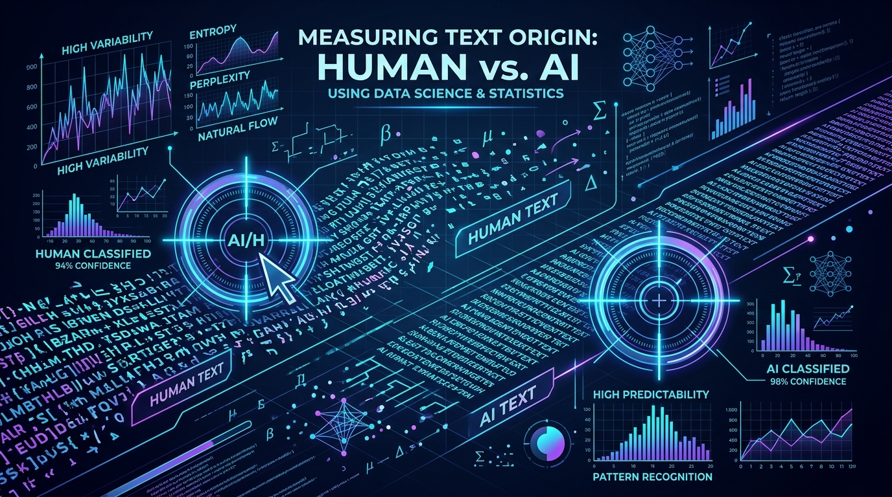

# Measured Humanizer

[](https://github.com/SadhvikChirunomula/measured-humanizer/actions/workflows/ci.yml)
[](https://opensource.org/licenses/MIT)
[](https://star-history.com/#SadhvikChirunomula/measured-humanizer&Date)

> An enterprise-grade AI writing calibrator and style enforcer that measures human-likeness statistically, eliminating subjective "AI tell" pattern-matching.



Measured Humanizer is an agent-agnostic skill that makes writing read as human-written by **measuring it**, not by pattern-matching a list of words someone decided sound like a robot. 

It ships a dependency-free Node scorer calibrated against **36 human-written and 45 AI-written technical documents**. Point it at a draft and it returns the single worst dimension plus an instruction for fixing it. Fix that one thing. Re-measure. Repeat until it passes.

That loop terminates. "Make this sound more human" does not.

## Table of Contents

- [Features](#features)
- [Supported Ecosystems](#supported-ecosystems)
- [Why Structural Measurement?](#why-structural-measurement)
- [Architecture & Workflow](#architecture--workflow)
- [Installation](#installation)
- [Usage & Integrations](#usage--integrations)
- [Recalibration](#recalibration)
- [Development & Testing](#development--testing)
- [Limitations](#limitations)
- [License](#license)

## Features

- **Statistical Calibration**: Rejects hardcoded word lists in favor of measurable structural variance (e.g., paragraph length variance, first-person rates).
- **Agent-Agnostic Core**: Runs natively as a CLI tool. Use it with Claude Code, GitHub Copilot, Codex, Antigravity, or in CI/CD pipelines.
- **Code Integrity Protection**: Includes a `--before` flag to ensure that an agent's "style improvements" don't secretly rewrite your code blocks or drop citations.
- **Deterministic Scoring**: Delivers reliable, non-flaky evaluations of prose without calling out to a black-box LLM classifier.

## Supported Ecosystems

While originally packaged as a Claude Code skill, Measured Humanizer acts as a standalone CLI tool that can be seamlessly integrated into any AI development workflow:

- **GitHub Copilot / Codex**: Can be invoked within Copilot Workspace, terminal chats, or as a pre-commit hook to govern generated documentation.
- **Claude Code**: Installs directly as a native skill.
- **Antigravity & AutoGPT**: Agents can run the scorer natively in an automated correction loop.
- **CI/CD Pipelines**: Enforce documentation standards directly in GitHub Actions or Jenkins.

## Why Structural Measurement?

Because the lists don't work. Here is what they actually measured on the corpus, as AUC, where 0.5 is a coin flip:

| Signal | Separation | Verdict |
|---|---|---|
| hedging words (*may*, *might*, *typically*) | 0.516 | useless — humans hedged **more** |
| bridge phrases (*moreover*, *furthermore*) | 0.527 | useless — near-zero in both classes |
| promotional adjectives (*robust*, *seamless*, *leverage*) | 0.535 | useless — no consistent direction |

Banning the word "may" accomplishes nothing. Humans used it more than the generated set did.

What separates the two classes is structural, and it isn't subtle:

| Dimension | Separation | Human | AI |
|---|---|---|---|
| paragraph length variance | **0.897** | 28.6 | 12.8 |
| first-person rate (/1k words) | **0.889** | 8.18 | 0.00 |
| em-dash rate | 0.736 | 0.00 | higher |
| sentence length variance | 0.720 | 10.3 | 7.7 |
| concrete-specific density | 0.686 | 28.0 | 19.9 |
| contraction rate | 0.663 | 10.2 | 7.9 |

AI writes paragraphs of near-uniform length and never says "we". Those two facts carry more signal than every phrase list combined.

Full derivation, including the design mistakes found along the way, is in [`skills/measured-humanizer/reference/calibration.md`](skills/measured-humanizer/reference/calibration.md).

## Architecture & Workflow

Three stages. **Calibration** happened once, offline, and produced `gate/thresholds.json`. **Scoring** is deterministic and runs on every invocation. **Correction** is the loop an agent drives.

### Stage 1: Calibration (Offline)


Every dimension is computed over both corpora, then ranked by how well it separates them — AUC. Anything below 0.65 is thrown away. The survivors keep their **range** (human percentile band) and their **weight** (the AUC itself). The cutoff is swept across candidate values and fixed where separation peaks.

### Stage 2: Scoring

Before anything is counted, `proseOnly()` strips the document down to prose: fenced blocks, inline code, headings, and tables are removed. 

What's left is measured three ways — population standard deviation for the variance dimensions, counts normalised per 1,000 words for the rate dimensions, and a plain ratio for the rest. `metrics()` returns sixteen measured dimensions plus raw counts.

### Stage 3: Verdict

```
composite = Σ strength(dimensions in range) / Σ strength(all gated dimensions)
pass      = composite >= 0.84  AND  no absolute rule tripped
```

Absolute rules (like `parallelism` and `discourse_markers`) sit outside that arithmetic entirely and can veto at any score.

### Stage 4: Correction Loop


Only the **single worst** dimension is fixed per pass. Fixing several at once trades one failing check against another. After each pass, integrity is checked against the pre-edit copy.

## Installation

**As a Claude Plugin** (recommended — updates with `/plugin`):

```bash
/plugin marketplace add SadhvikChirunomula/measured-humanizer
/plugin install measured-humanizer@measured-humanizer
```

**As a plain skill for Claude Code / CLI usage**:

```bash
curl -fsSL https://raw.githubusercontent.com/SadhvikChirunomula/measured-humanizer/main/install.sh | bash
```

**From source (for CI/CD or custom agent integration)**:

```bash
git clone https://github.com/SadhvikChirunomula/measured-humanizer.git
cd measured-humanizer
npm install # if dependencies are added in the future
```

*Note: Node 14+ is the only requirement to run the gate.*

## Usage & Integrations

Ask your agent (Claude, Copilot, Codex, Antigravity) to humanize, de-slop, or audit a draft. Or run the scorer directly from the CLI:

```bash
GATE=./skills/measured-humanizer/gate/style_gate.js

node "$GATE" draft.md --brief
```

```
pass=false composite=0.139/0.84 VETOED
failing=9: parallelism,discourse_markers,is_that_filler,long_word_rate,contraction_rate,para_stdev,first_person_rate,concrete_rate,sent_stdev
worst=parallelism value=3.08
fix: Remove every "not X, but Y" / "it isn't A, it's B" construction. This pattern appeared zero times across 36 human documents.
```

Drop `--brief` for the full JSON: every metric, every failure, the heading zones.

| Flag | Effect |
|---|---|
| `--brief` | Human-readable summary. Cheap enough to run inside an agent loop. |
| `--before old.md` | Integrity check. Fails if a fenced code block changed or a link was dropped. |
| `--no-zoning` | Skip the H2/H3 heading rules. Use for READMEs, design docs, email. |
| `--thresholds f.json` | Use your own calibration instead of the shipped one. |

### Integrity Check
A more human-sounding article that dropped its sources is a worse article. Use the `--before` flag to ensure your AI agent didn't quietly rewrite shell snippets or drop citations:

```bash
cp draft.md draft.orig.md
# ...let agent edit one dimension...
node "$GATE" draft.md --brief --before draft.orig.md
```

## Recalibration

The shipped thresholds are fitted to technical practitioner prose. Marketing copy, fiction and academic writing each want their own fit.

`gate/thresholds.json` holds the ranges, the AUC-derived weight per dimension, and the swept cutoff. To refit: gather ~30+ documents per class in your domain, run `metrics()` from `gate/style_gate.js` over both sets, keep dimensions with AUC ≥ 0.65, set each range to the human percentile band, and sweep the cutoff for best separation.

## Development & Testing

```bash
./test/run.sh
```
Two fixtures carry the load: a document written to look generated must fail and get vetoed, and one written the way the corpus measures must pass.

## Limitations

- **Not an AI-detector bypass.** It's a filter, not an oracle.
- **Not a substitute for having something to say.** A document contorted to hit the numbers is not good writing, it's a document that games a gate.
- **Not domain-general as shipped.** It is calibrated for technical prose. See recalibration above.

## License

MIT. The corpora themselves are not redistributed — what ships is the fitted result.
