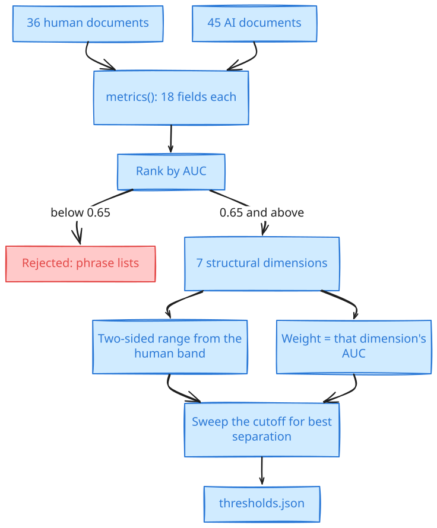
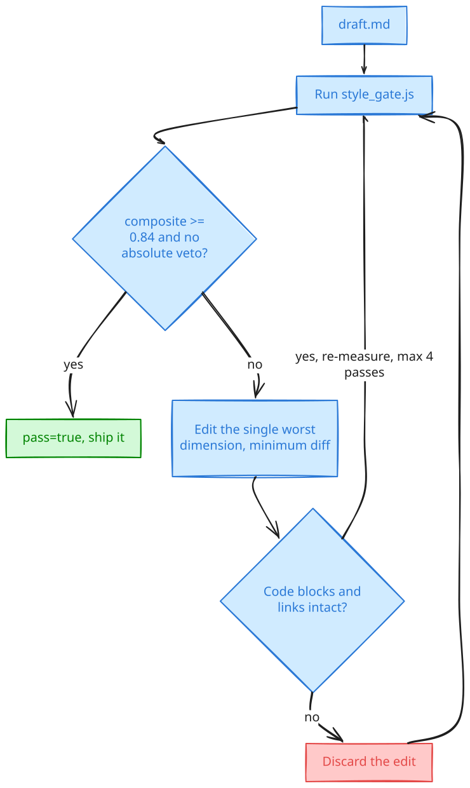

# measured-humanizer

A Claude Code skill that makes writing read as human-written by **measuring it**,
not by pattern-matching a list of words someone decided sound like a robot.

Ships a dependency-free Node scorer calibrated against **36 human-written and 45
AI-written technical documents**. Point it at a draft and it returns the single
worst dimension plus an instruction for fixing it. Fix that one thing.
Re-measure. Repeat until it passes.

That loop terminates. "Make this sound more human" does not.

## Why not just use a list of AI tells?

Because the lists don't work. Here is what they actually measured on the corpus,
as AUC, where 0.5 is a coin flip:

| Signal | Separation | Verdict |
|---|---|---|
| hedging words (*may*, *might*, *typically*) | 0.516 | useless — humans hedged **more** |
| bridge phrases (*moreover*, *furthermore*) | 0.527 | useless — near-zero in both classes |
| promotional adjectives (*robust*, *seamless*, *leverage*) | 0.535 | useless — no consistent direction |

Banning the word "may" accomplishes nothing. Humans used it more than the
generated set did.

What separates the two classes is structural, and it isn't subtle:

| Dimension | Separation | Human | AI |
|---|---|---|---|
| paragraph length variance | **0.897** | 28.6 | 12.8 |
| first-person rate (/1k words) | **0.889** | 8.18 | 0.00 |
| em-dash rate | 0.736 | 0.00 | higher |
| sentence length variance | 0.720 | 10.3 | 7.7 |
| concrete-specific density | 0.686 | 28.0 | 19.9 |
| contraction rate | 0.663 | 10.2 | 7.9 |

AI writes paragraphs of near-uniform length and never says "we". Those two facts
carry more signal than every phrase list combined.

Full derivation, including the design mistakes found along the way, is in
[`skills/measured-humanizer/reference/calibration.md`](skills/measured-humanizer/reference/calibration.md).

## How it works

Three stages. **Calibration** happened once, offline, and produced
`gate/thresholds.json`. **Scoring** is deterministic and runs on every
invocation. **Correction** is the loop an agent drives.

### Stage 1: where the thresholds came from



Every dimension is computed over both corpora, then ranked by how well it
separates them — AUC, the probability that a randomly chosen human document
scores higher than a randomly chosen AI one. Anything below 0.65 is thrown away.
That threshold is what eliminated the phrase lists: hedging landed at 0.516,
which is a coin flip with extra steps.

The survivors keep two things. Their **range** is the human percentile band, and
it's two-sided — an upper bound as well as a lower one, because a floor alone is
satisfied by injecting one stray four-word sentence. Their **weight** is the AUC
itself, so a dimension that separates the corpora better counts for more. The
cutoff is then swept across candidate values and fixed where separation peaks.

Nothing here is hand-tuned. That's the whole point: a guessed threshold is the
taste-based approach wearing a number.

### Stage 2: how a document becomes numbers

Before anything is counted, `proseOnly()` strips the document down to prose:
fenced blocks are dropped entirely, inline code collapses to the token `CODE`,
and headings and table rows are removed. A single code block otherwise dominates
every sentence-length statistic in the document.

That has one consequence worth knowing, because it will surprise you: a
backticked identifier does **not** count toward `concrete_rate`. Only identifiers
sitting in running prose do. Naming `retry-attempt` in a sentence counts; putting
it in backticks does not.

What's left is measured three ways — population standard deviation for the
variance dimensions, counts normalised per 1,000 words for the rate dimensions,
and a plain ratio for the rest. `metrics()` returns eighteen fields: sixteen
measured dimensions plus the raw word and sentence counts. **Seven of them are
gated.** The rest are computed and reported so you can see them, including the
phrase-list signals that failed calibration.

### Stage 3: how numbers become a verdict

```
composite = Σ strength(dimensions in range) / Σ strength(all gated dimensions)
pass      = composite >= 0.84  AND  no absolute rule tripped
```

| Dimension | Range | Weight |
|---|---|---|
| `para_stdev` | 14.37 – 85.02 | 0.90 |
| `first_person_rate` | 0.73 – 26.03 | 0.89 |
| `emdash_rate` | 0 – 4.67 | 0.74 |
| `long_word_rate` | 65.07 – 200 | 0.74 |
| `sent_stdev` | 6.35 – 77.14 | 0.72 |
| `concrete_rate` | 11.09 – 98.79 | 0.69 |
| `contraction_rate` | 5.12 – 24.06 | 0.66 |

Total weight is **5.34**. It's a weighted composite rather than all-must-pass
because requiring every dimension in range measured 0% pass for *both* corpora —
a gate that rejects all genuine human writing isn't strict, it's broken.

Absolute rules sit outside that arithmetic entirely. `parallelism`,
`discourse_markers`, `is_that_filler` and `question_h2_headings` veto at any
score, because they measure ~0.00 in both reference corpora while appearing
freely in generated output. AUC is structurally blind to a defect neither
reference class exhibits.

**Worked example**, from the two fixtures in this repo:

```
$ node gate/style_gate.js test/fixtures/human_shaped.md --brief
pass=true composite=1/0.84
failing=0

$ node gate/style_gate.js test/fixtures/ai_shaped.md --brief
pass=false composite=0.139/0.84 VETOED
failing=9: parallelism,discourse_markers,is_that_filler,long_word_rate,...
worst=parallelism value=3.08
```

The second document has exactly one gated dimension in range — `emdash_rate`,
weight 0.74 — so its composite is 0.74 / 5.34 = **0.139**. It also trips three
absolute rules. Either failure alone would have stopped it, which is the point:
the composite and the vetoes are independent, and a document can fail on both
paths at once.

### Stage 4: the correction loop



Only the **single worst** dimension is fixed per pass. Fixing several at once
trades one failing check against another and the loop stops converging — that
was measured on a production pipeline, not assumed. Each edit is minimal: every
sentence not being fixed comes back byte-identical.

After each pass, integrity is checked against the pre-edit copy. If a fenced code
block changed or a link disappeared, that pass is discarded rather than accepted,
because an LLM told to "improve style" will quietly rewrite your shell snippets
if nothing is watching. A more human-sounding document that lost its citations is
a worse document.

The loop stops at `pass=true` or after four passes. A dimension that survives
four targeted edits usually means the draft needs restructuring, not styling.

> Both diagrams are generated from the mermaid sources in `docs/`. Paste either
> `.mmd` into excalidraw.com's "Mermaid to Excalidraw" import to get an editable
> scene.

## Install

**As a plugin** (recommended — updates with `/plugin`):

```
/plugin marketplace add SadhvikChirunomula/measured-humanizer
/plugin install measured-humanizer@measured-humanizer
```

**As a plain skill**, for the current user:

```bash
curl -fsSL https://raw.githubusercontent.com/SadhvikChirunomula/measured-humanizer/main/install.sh | bash
```

Or from a checkout, into one project only:

```bash
git clone https://github.com/SadhvikChirunomula/measured-humanizer.git
cd measured-humanizer
./install.sh              # ~/.claude/skills
./install.sh --project    # ./.claude/skills, this repo only
```

`install.sh` backs up any existing install rather than overwriting it, then runs
the gate once to prove it works. Node 14+ is the only requirement.

## Use

Ask Claude Code to humanize, de-slop, or audit a draft and the skill loads
itself. Or run the scorer directly:

```bash
GATE=~/.claude/skills/measured-humanizer/gate/style_gate.js

node "$GATE" draft.md --brief
```

```
pass=false composite=0.139/0.84 VETOED
failing=9: parallelism,discourse_markers,is_that_filler,long_word_rate,contraction_rate,para_stdev,first_person_rate,concrete_rate,sent_stdev
worst=parallelism value=3.08
fix: Remove every "not X, but Y" / "it isn't A, it's B" construction. This pattern appeared zero times across 36 human documents.
```

Drop `--brief` for the full JSON: every metric, every failure, the heading zones.

| Flag | Effect |
|---|---|
| `--brief` | Human-readable summary. Cheap enough to run inside an agent loop. |
| `--before old.md` | Integrity check. Fails if a fenced code block changed or a link was dropped. |
| `--no-zoning` | Skip the H2/H3 heading rules. Use for READMEs, design docs, email. |
| `--thresholds f.json` | Use your own calibration instead of the shipped one. |

Exit code is always 0 for a scored document; read `pass`. Exit 2 means bad usage.

### Integrity is the part people skip

```bash
cp draft.md draft.orig.md
# ...edit one dimension...
node "$GATE" draft.md --brief --before draft.orig.md
```

`integrity=false` means the edit damaged a code block or lost a citation. Roll
that pass back. A more human-sounding article that dropped its sources is a worse
article, and an LLM asked to "improve style" will quietly rewrite your shell
snippets if nothing is watching.

## Recalibrate it for your voice

The shipped thresholds are fitted to technical practitioner prose. Marketing
copy, fiction and academic writing each want their own fit, and using someone
else's ranges is how you end up with a gate that enforces a voice you don't want.

`gate/thresholds.json` holds the ranges, the AUC-derived weight per dimension,
and the swept cutoff. To refit: gather ~30+ documents per class in your domain,
run `metrics()` from `gate/style_gate.js` over both sets, keep dimensions with
AUC ≥ 0.65, set each range to the human percentile band, and sweep the cutoff for
best separation. Don't hand-edit the numbers — a guessed threshold is the
taste-based approach with extra steps.

## Test

```bash
./test/run.sh
```

14 assertions. Two fixtures carry the load: a document written to look generated
must fail and get vetoed, and one written the way the corpus measures must pass.
Run it after any change to the metrics or the thresholds — if either direction
breaks, the gate no longer separates the classes it claims to.

## What this is not

- **Not an AI-detector bypass.** It measures properties that separated one
  labelled corpus. That's a claim about prose, not about some classifier neither
  of us has seen. Held-out rates at the shipped cutoff are 75% of human documents
  passing and 11% of generated ones slipping through — a filter, not an oracle.
- **Not a substitute for having something to say.** Every dimension here is a
  proxy. A document contorted to hit the numbers is not good writing, it's a
  document that games a gate. The scorer tells you where to look; it doesn't know
  whether the argument holds.
- **Not domain-general as shipped.** See recalibration above.

## Licence

MIT. The corpora themselves are not redistributed — what ships is the fitted
result.
